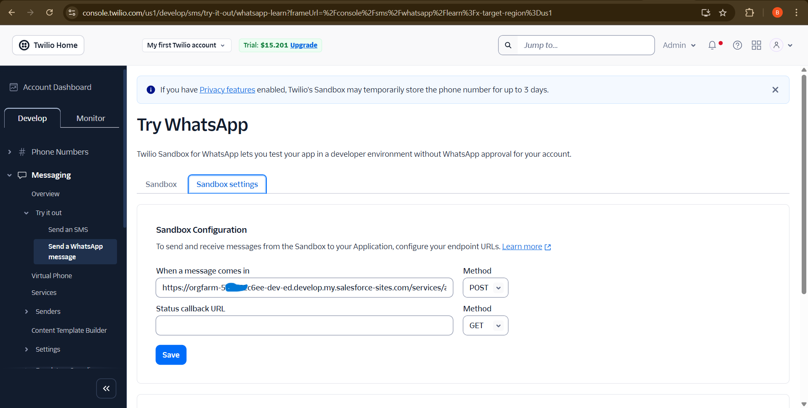
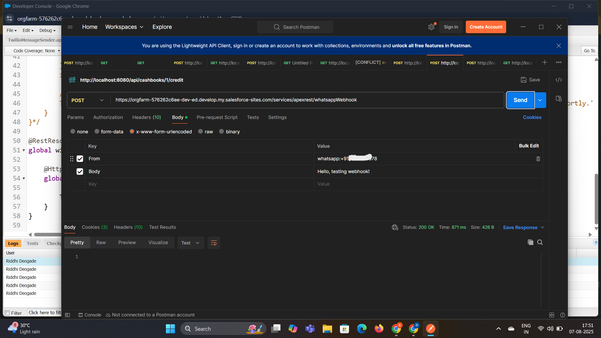
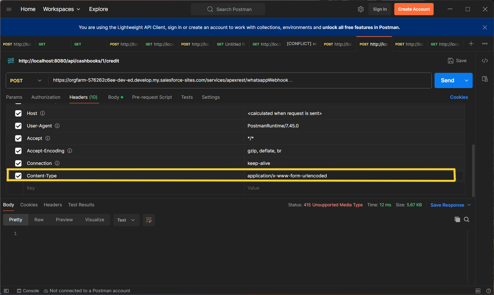
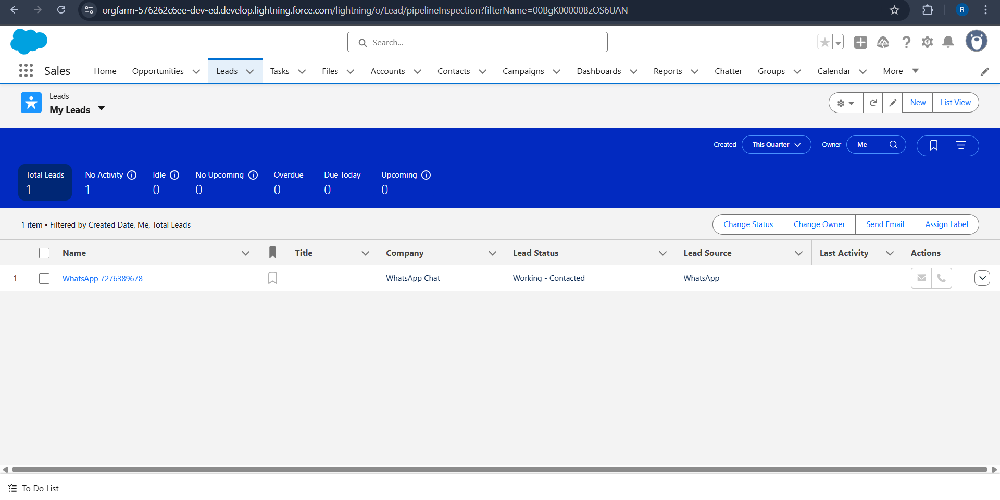
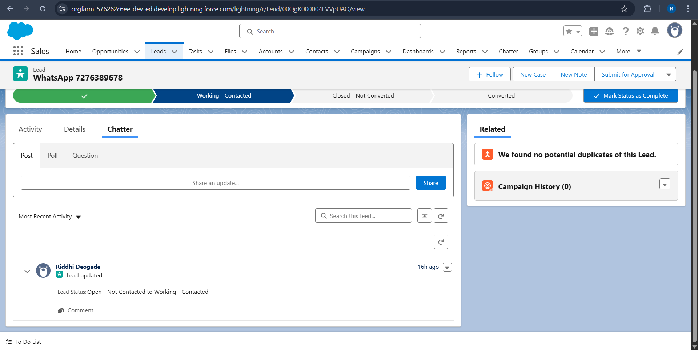
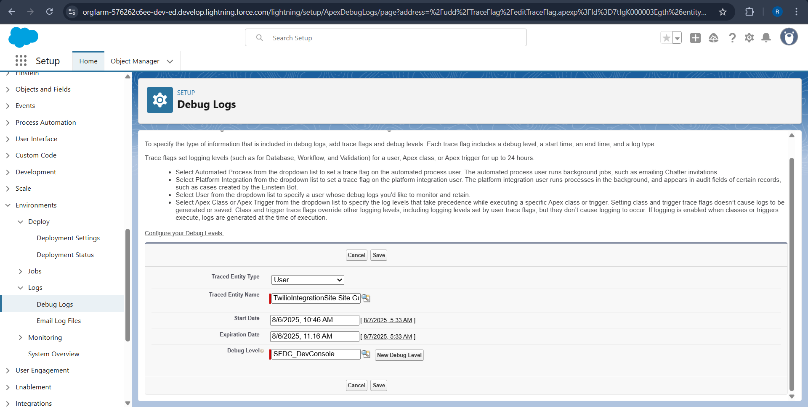
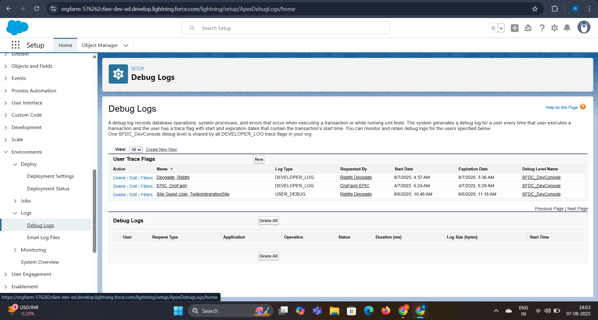
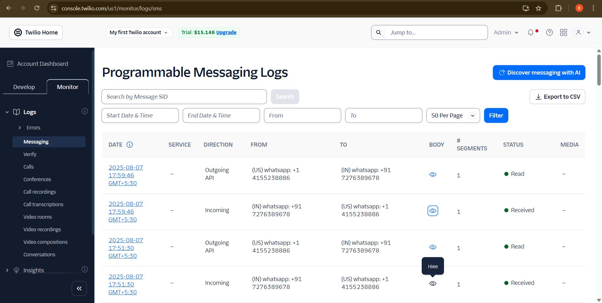

# Salesforcs-WhatsApp-Integration-using-Webhooks

## 🔁 PART 1: Set Up WhatsApp on Twilio (Sandbox Mode)
✅ Step 1: Access WhatsApp Sandbox
Go to your Twilio Console WhatsApp Sandbox.

You’ll see:

A sandbox number

A code like: join smoke-blue (this is your keyword)

✅ Step 2: Join the Sandbox
On your WhatsApp, send the join code (e.g., join smoke-blue) to the sandbox number shown.

You’ll now be connected to Twilio WhatsApp Sandbox.

🔁 Full Setup to Create Salesforce Webhook for Twilio Integration
🔧 Prerequisites:
You have a Salesforce Developer Org (sign up here: https://developer.salesforce.com/signup)

You are using Twilio Sandbox for WhatsApp (setup done)

You are familiar with basic Salesforce navigation

## ✅ PART 1: Create a Salesforce Site
Salesforce Sites allow you to expose Apex classes as public endpoints.

🔹 Step 1.1: Enable Sites
Go to Setup

In Quick Find, search: Sites

Click Sites, then click "New"

🔹 Step 1.2: Configure the Site
Field	Value Example
Site Label	TwilioIntegrationSite
Site Name	TwilioIntegrationSite
Site Contact	[Select your admin user]
Default Web Address	twiliointegration (will be part of URL)
Active	✅ Check it
Active Site Home Page	InMaintenance or UnderConstruction
Click Save	

After saving, you’ll get a Site URL like:


https://yourdomain-dev-ed.my.site.com/twiliointegration


## ✅ PART 2: Create Apex Class for Webhook
🔹 Step 2.1: Go to Developer Console
Click the gear icon (⚙️) → Developer Console

File → New → Apex Class

Name it: TwilioWebhook

🔹 Step 2.2: Paste This Code:
apex

    @RestResource(urlMapping='/TwilioWebhook/*')
    global with sharing class TwilioWebhook {
        @HttpPost
        global static void handleIncoming() {
            RestRequest req = RestContext.request;
            String from = req.params.get('From');
            String body = req.params.get('Body');
    
            // Log received message
            System.debug('Incoming from: ' + from + ', Message: ' + body);
    
            // Optional: Create a record or reply
        }
    }
## ✅ PART 3: Give Guest User Access
By default, your site is read-only and has no Apex access. Let’s change that.

🔹 Step 3.1: Assign Apex Class Permission to Guest User
Go back to Sites (Setup → Sites)

Find your Site → Click Site Label

Click Public Access Settings

Under Enabled Apex Class Access:

Click Edit

Add TwilioWebhook → Save

_______________________________________________________________
🔹 Step 3.2: Allow Object Access (if needed)
If you are saving messages as records (e.g. Leads, Cases), also:
✅ Step-by-Step: Access Object Settings for Guest User in Salesforce
🔹 Step 1: Open Your Site
Go to Setup (gear icon > Setup).

In the Quick Find box (top left), type and select Sites.

Scroll to find the Site you created (e.g., TwilioIntegrationSite).

Click the Site Label (blue text link).

🔹 Step 2: Open Public Access Settings
On the site details page, click Public Access Settings (a button near the top).

This opens the Guest User Profile.

🔹 Step 3: Find Object Settings
Scroll down you’ll see a list of all standard objects permission.

🔹 Step 4: Edit Permissions
Click on the object you want to give access to (e.g., Lead, Case, or your custom object).

Click Edit (top of the page).

Enable:

✅ Read

✅ Create

Click Save.
__________________________________________________________________

## ✅ PART 4: Test Your Webhook
🔹 Step 4.1: Copy the Full URL
It will be:

    https://yourdomain-dev-ed.my.site.com/twiliointegration/services/apexrest/TwilioWebhook
This is your Twilio webhook URL.

## ✅ PART 5: Add URL in Twilio
Go to Twilio WhatsApp Sandbox Settings

In “When a Message Comes In” field, paste:

    https://yourdomain-dev-ed.my.site.com/twiliointegration/services/apexrest/TwilioWebhook
Save


📦 BONUS (Optional): Store or Auto-Reply to Messages

---

## 🔁 Salesforce + Twilio WhatsApp Auto-Reply Workflow (Complete Guide)

### 🧩 1. **Create a Lead Source Picklist Value**

1. Navigate to **Setup** → Object Manager → `Lead`.
2. Go to **Fields & Relationships** → Find `Lead Source`.
3. Click **Edit** → Add new value: `WhatsApp`.
4. Click **Save**.


---

### 👤 2. **Create a Salesforce Site**

1. **Setup** → Quick Find: **Sites**.
2. Register a unique domain if not already done (e.g., `orgfarm-xxxxx`).
3. Click **New** under Sites.

   * Site Label: `TwilioIntegrationSite`
   * Active: ✅
   * Default Web Address: `twiliointegration`
   * Click **Save**.

---

### 🔓 3. **Update Guest User Profile**

1. Go to **Setup** → **Sites**.
2. Click **Site Label** (e.g., `TwilioIntegrationSite`).
3. Click **Public Access Settings**.
4. On the profile page:

   * ✅ **Object Permissions** → Leads → Read + Create.
   * ✅ **Apex Class Access** → Add:

     * `WhatsAppWebhookHandler`
     * `TwilioMessageSender`
   * ✅ **Field-Level Security (FLS)** → Lead → Enable Read Access to:

     * `MobilePhone`, `Company`, `Description`, `Lead Source`, `LastName`

---

### 🧠 4. **Create Apex Classes**

#### ✅ `TwilioMessageSender.cls`

```apex
public class TwilioMessageSender {

    public static void sendWhatsAppMessage(String to, String body) {
        String ACCOUNT_SID = 'your_ACCOUNT_SID';
        String AUTH_TOKEN = 'your_AUTH_TOKEN';
        String fromNumber = 'whatsapp:+14xxxxxxxx'; // Twilio Sandbox or Business Number

        Http http = new Http();
        HttpRequest req = new HttpRequest();
        req.setEndpoint('https://api.twilio.com/2010-04-01/Accounts/' + ACCOUNT_SID + '/Messages.json');
        req.setMethod('POST');

        String credentials = ACCOUNT_SID + ':' + AUTH_TOKEN;
        Blob headerValue = Blob.valueOf(credentials);
        String authorizationHeader = 'Basic ' + EncodingUtil.base64Encode(headerValue);
        req.setHeader('Authorization', authorizationHeader);
        req.setHeader('Content-Type', 'application/x-www-form-urlencoded');

        String bodyParams = 'From=' + EncodingUtil.urlEncode(fromNumber, 'UTF-8') +
                            '&To=' + EncodingUtil.urlEncode(to, 'UTF-8') +
                            '&Body=' + EncodingUtil.urlEncode(body, 'UTF-8');
        req.setBody(bodyParams);

        HttpResponse res = http.send(req);
        System.debug('Twilio Response: ' + res.getBody());
        System.debug('Twilio Status Code: ' + res.getStatusCode());
System.debug('Twilio Status Body: ' + res.getBody());

    }
}
```

#### ✅ `WhatsAppWebhookHandler.cls`

```apex
/*@RestResource(urlMapping='/whatsappWebhook')
global with sharing class WhatsAppWebhookHandler {

    @HttpPost
    global static void handleIncoming() {
        RestRequest req = RestContext.request;
        String rawBody = req.requestBody.toString();

        // Log raw body
        System.debug('Raw Body: ' + rawBody);

        // Parse form-encoded parameters
        Map<String, String> params = new Map<String, String>();
        for (String part : rawBody.split('&')) {
            List<String> pair = part.split('=');
            if (pair.size() == 2) {
                params.put(
                    EncodingUtil.urlDecode(pair[0], 'UTF-8'),
                    EncodingUtil.urlDecode(pair[1], 'UTF-8')
                );
            }
        }

        String fromNumber = params.get('From'); // WhatsApp sender number
        String msg = params.get('Body');

        if (String.isBlank(fromNumber) || String.isBlank(msg)) {
            System.debug('⚠️ Missing From or Body in request.');
            return;
        }

        System.debug('✅ Parsed From: ' + fromNumber);
        System.debug('✅ Parsed Message: ' + msg);

        // ✅ Create Lead
        Lead newLead = new Lead(
            LastName = fromNumber.replace('whatsapp:', ''),
            Company = 'WhatsApp Chat',
            Description = msg,
            LeadSource = 'WhatsApp',
            MobilePhone = fromNumber.replace('whatsapp:', '')
        );
        insert newLead;

        // ✅ Auto-Reply
        TwilioMessageSender.sendWhatsAppMessage('whatsapp:+91XXXXXXXXXXX', 'Thanks for contacting us! A member of our team will reach out shortly.');
    }
}*/


// following code executed well with postman
@RestResource(urlMapping='/whatsappWebhook')
global with sharing class WhatsAppWebhookHandler {

    @HttpPost
    global static void handleIncoming() {

        TwilioMessageSender.sendWhatsAppMessage('whatsapp:+91XXXXXXXXXX', 'This is a test message from Salesforce!');
    }
}

```

---

### 🌐 5. **Get Public URL for Webhook**

Your public endpoint will be:

```
https://your-site-domain.my.salesforce-sites.com/services/apexrest/whatsappWebhook
```

> Example:

```
https://orgfarm-xxxxx-dev-ed.develop.my.salesforce-sites.com/services/apexrest/whatsappWebhook
```



---

### 🧪 6. **Test with Postman**

1. Open Postman → Set method to `POST`.
2. URL: your Salesforce public webhook URL.
3. Go to **Body** tab → select `x-www-form-urlencoded`.
4. Add keys:

   * `From` → `whatsapp:+91XXXXXXXXXX`
   * `Body` → `Hello, testing webhook!`
5. Hit **Send**.
6. You should get `Status: 200 OK`.



---

### ✅ 7. **Verify in Salesforce**

1. Go to **Salesforce → Leads**.
2. New Lead should appear with:

   * LastName = WhatsApp number (no prefix)
   * Description = Message
   * Lead Source = WhatsApp




<!-- *********optional***********
3. salesforce debug log:

 -->

---

### 📬 8. **Check Auto-Reply from Twilio**

1. Go to Twilio → Monitor → Logs → Messaging.
2. Look for **Outgoing API**.
3. Check that the auto-reply message was:

   * Sent from sandbox number.
   * Delivered successfully to sender.


---

### 🔍 9. **If Issues Occur**

* **Enable Debug Logs** for Guest User Profile in Salesforce.
* **Check Twilio Logs** for errors (e.g., 400 Bad Request).
* **Ensure Guest User Profile has API & Apex access**.
* **Ensure Twilio sandbox is configured and WhatsApp number joined**.

---
